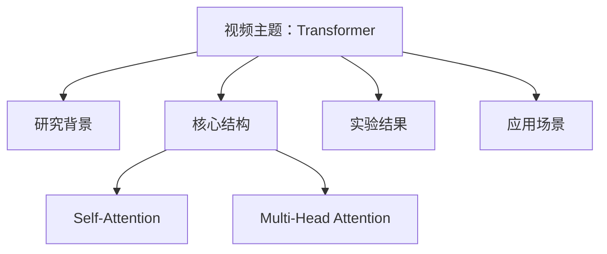

# 例：VideoScholar 视频学习与知识整理 Agent 工具构建

## 核心任务

综合运用 Video-RAG、多模态 RAG、Agent 工作流编排和大语言模型生成技术，构建一个面向课程视频、学术讲座视频、会议录屏和知识类视频的智能学习助手工具。

系统能够对用户上传的视频进行自动解析，提取其中的语音文本、关键画面、时间片段和主题内容，构建视频专属知识库。在此基础上，系统可以支持用户围绕视频内容进行自然语言问答，并自动生成学习笔记、章节摘要、知识点列表和思维导图等学习材料，帮助用户快速理解、检索和复习视频内容。

本项目不以重新训练多模态大模型为主要目标，而是基于现有 RAG 框架和多模态解析工具，重点实现一个具有完整流程、明确场景和较强可用性的 Agent 工具系统。

---

## 功能要求

### 1. 视频内容自动解析与知识库构建

系统应支持用户上传本地视频或提供视频文件路径，自动完成视频内容解析工作。

主要包括：

* 自动提取视频中的语音内容，并转写为文本；
* 对视频进行时间切片，形成按时间顺序排列的视频片段；
* 提取视频中的关键帧、字幕、画面信息和重要事件；
* 将视频文本、时间戳、关键帧信息进行对齐；
* 基于解析结果构建视频专属向量知识库；
* 支持后续问答、摘要和知识整理任务调用该知识库。

该部分体现系统从“原始视频”到“可检索知识库”的自动化处理能力。

---

### 2. 多 Agent 协同工作流设计

系统应设计多个具有不同职责的 Agent，通过任务规划与工具调用完成视频学习任务。

建议至少包含以下 Agent 模块：

#### Video Analysis Agent：视频解析 Agent

负责对视频进行基础解析，包括音频转写、字幕提取、关键帧提取、时间切片和内容清洗。

输出内容可以包括：

```json
{
  "timestamp": "00:12:35",
  "text": "本节主要介绍 Transformer 中自注意力机制的基本原理",
  "keywords": ["Transformer", "Self-Attention"],
  "frame_path": "frames/frame_123.jpg"
}
```

#### Knowledge Index Agent：知识索引 Agent

负责将视频解析结果转化为可检索知识库，包括文本分块、向量化存储、关键词索引、时间戳索引和片段级元数据管理。

需要支持根据问题检索相关视频片段，并返回对应的文本、时间点和证据来源。

#### QA Agent：视频问答 Agent

负责根据用户问题调用知识库进行检索，并结合大语言模型生成回答。

回答应尽量包含：

* 问题的直接答案；
* 对应的视频时间点；
* 相关字幕或内容依据；
* 必要的解释说明。

例如：

```text
问题：视频中是如何解释自注意力机制的？

回答：视频在 00:12:35 到 00:15:10 之间介绍了自注意力机制。其核心思想是让序列中的每个词根据与其他词的相关性动态分配注意力权重，从而获得上下文相关的表示。
```

#### Note Agent：学习笔记 Agent

负责根据视频内容自动生成结构化学习笔记。

笔记应包括：

* 视频主题；
* 章节划分；
* 每章核心知识点；
* 重要概念解释；
* 可复习的总结内容。

#### MindMap Agent：思维导图 Agent

负责根据视频内容生成知识结构图或思维导图。

可以输出 Mermaid、Markdown 层级结构或图片形式，例如：



---

### 3. 面向视频内容的智能问答

系统应支持用户围绕视频内容进行自由提问。

问题类型至少包括：

* 视频主要讲了什么？
* 某个概念在视频中是如何解释的？
* 某个知识点出现在哪个时间段？
* 视频中前后内容之间有什么逻辑关系？
* 请总结某一段视频的主要内容。
* 请根据视频内容生成复习笔记。
* 请根据视频生成思维导图。

系统回答时应优先基于视频知识库内容，不应脱离视频内容随意编造。对于知识库中没有明确依据的问题，应提示“视频中未明确提到”或“根据已有片段无法判断”。

---

### 4. 自动知识整理与学习材料生成

系统应不仅支持问答，还应具备自动整理视频学习材料的能力。

至少实现以下功能中的若干项：

1. **自动章节划分**
   根据视频内容将长视频划分为多个主题章节，并生成章节标题和时间范围。

2. **自动生成学习笔记**
   将视频内容整理为适合学习和复习的 Markdown 笔记。

3. **自动提取核心知识点**
   从视频中提取关键概念、重要术语、方法步骤和结论。

4. **自动生成思维导图**
   根据视频内容生成知识结构图，帮助用户理解知识点之间的关系。

---

### 5. 教育场景落地

本系统应重点面向教育和学习场景进行设计，而不是简单的视频问答 Demo。

可选择以下应用场景之一作为主要展示方向：

* 课程视频学习助手；
* 学术讲座视频整理工具；
* 论文解读视频分析助手；
* 会议录屏纪要生成工具；
* 实验操作视频复盘工具；
* 技术培训视频问答助手。

系统应体现实际使用价值。例如，对于一段课程视频，用户可以快速获得：

```text
1. 这节课讲了什么？
2. 每一部分分别在什么时候讲？
3. 重点知识点有哪些？
4. 老师如何解释某个概念？
5. 根据这节课生成一份复习笔记。
6. 根据这节课生成一张知识结构图。
```

---

## 性能要求

1. **视频主题识别准确率不低于 85%**
   系统应能够较准确识别视频主题、核心内容和主要知识点。

2. **问答内容应与视频事实基本一致**
   生成回答应基于视频知识库内容，不能出现明显脱离视频事实的幻觉。

3. **时间定位结果应基本准确**
   对涉及“在哪个时间段讲到某内容”的问题，系统应能够返回相对准确的视频时间点或片段范围。

4. **章节划分应具备合理性**
   自动划分的视频章节应与视频内容变化基本一致，不应出现明显主题错乱。

5. **学习笔记结构清晰**
   自动生成的学习笔记应具有清晰的标题、层级和知识点组织方式，便于用户阅读和复习。

6. **思维导图无明显逻辑错误**
   生成的知识结构图应能反映视频主要内容之间的层级关系和逻辑关系。

7. **系统具备可演示性**
   由于视频解析和知识库构建过程耗时较长，系统可采用“离线预处理 + 在线问答展示”的方式进行 Demo。
   在展示时，应重点体现知识库构建后的问答、摘要、笔记和思维导图生成效果。

---

## 提交材料

### 1. 课题报告

报告需完整说明系统的设计与实现过程，建议包含以下内容：

1. **项目背景与意义**
   说明传统视频学习存在的问题，例如长视频检索困难、复习效率低、难以快速定位知识点等，并说明 VideoScholar 的应用价值。

2. **需求分析**
   分析系统面向的用户、应用场景和核心功能需求。

3. **系统总体架构**
   给出系统架构图，说明视频输入、视频解析、多模态索引、知识库构建、Agent 调度、问答生成和结果展示之间的关系。

4. **Agent 工作流设计**
   说明各个 Agent 的功能分工、输入输出和协作方式。
   重点解释 Video Analysis Agent、Knowledge Index Agent、QA Agent、Note Agent、MindMap Agent 等模块如何共同完成任务。

5. **核心算法与技术实现**
   说明系统中用到的关键技术，例如：

   * 视频切片；
   * 音频转写；
   * 关键帧提取；
   * 文本分块；
   * 向量检索；
   * 多模态 RAG；
   * Prompt 设计；
   * Agent 工具调用；
   * 时间戳索引；
   * Markdown / Mermaid 生成。

6. **系统功能实现**
   展示系统主要功能，包括视频知识库构建、视频问答、章节摘要、学习笔记生成、思维导图生成等。

7. **创新点说明**
   重点说明本项目相对普通 RAG Demo 的改进之处，例如：

   * 从单一问答扩展为多 Agent 协同学习助手；
   * 从文本检索扩展为视频片段级知识检索；
   * 从回答生成扩展为笔记、摘要、思维导图等学习材料生成；
   * 引入时间戳证据，提高回答可追溯性；
   * 面向教育场景进行完整产品化设计。

8. **系统测试与结果分析**
   至少选取若干个视频进行测试，展示系统在主题识别、问答准确性、时间定位、笔记生成和思维导图生成方面的效果。

9. **问题与改进方向**
   说明当前系统存在的不足，例如视频预处理耗时较长、关键帧理解能力有限、复杂推理问题效果不足等，并提出后续优化方向。

10. **小结与心得**
    总结项目实现过程中的收获，包括对 RAG、Agent、多模态信息处理和系统工程设计的理解。

---

### 2. 附录

附录应包含不少于 **3 个不同视频场景** 的测试文档。

建议选择以下类型视频：

1. **课程讲解类视频**
   例如人工智能、操作系统、计算机网络、深度学习等课程片段。

2. **学术报告或论文解读视频**
   例如某篇论文的方法讲解、实验结果分析或研究背景介绍。

3. **技术演示或实验操作视频**
   例如系统操作教程、代码讲解视频、实验流程演示视频。

每个测试文档建议包括：

* 视频基本信息；
* 视频主题识别结果；
* 自动章节划分结果；
* 关键时间点列表；
* 用户问答样例；
* 自动生成的学习笔记；
* 自动生成的思维导图；
* 系统输出结果截图；
* 结果分析与不足说明。

另需提交系统 Demo 视频，展示完整使用流程，包括：

```text
上传视频 / 选择视频
→ 视频解析与知识库构建
→ 用户提问
→ 返回带时间戳的回答
→ 自动生成笔记
→ 自动生成思维导图
→ 展示最终学习材料
```

---

### 3. 代码与接口文档

提交完整代码及相关说明，建议包括：

* 项目源码；
* 环境配置文件；
* 依赖库说明；
* 启动命令；
* API 文档；
* 模块说明；
* 测试样例；
* Demo 数据。

技术栈不限，可采用：

```text
Python + RAG-Anything / LlamaIndex / LangChain / FastAPI / Streamlit / Gradio / Chroma / FAISS / Milvus
```

也可以使用其他大模型 API、多模态模型或本地模型进行实现。

代码应尽量模块化，建议至少包含：

```text
video_parser.py        视频解析模块
index_builder.py       知识库构建模块
retriever.py           检索模块
qa_agent.py            问答 Agent
note_agent.py          笔记生成 Agent
mindmap_agent.py       思维导图 Agent
app.py                 系统入口或前端界面
README.md              项目说明文档
```

---

## 项目定位总结

本课题最终目标不是单纯实现一个“视频问答 Demo”，而是构建一个面向教育场景的 **视频学习 Agent 工具**。

系统应体现以下特点：

```text
视频可解析
知识可检索
问题可回答
证据可追溯
笔记可生成
结构可视化
学习可复用
```

通过多 Agent 协同设计，将视频内容从“难以快速浏览的长媒体”转化为“可搜索、可问答、可复习、可结构化管理的学习知识库”。
